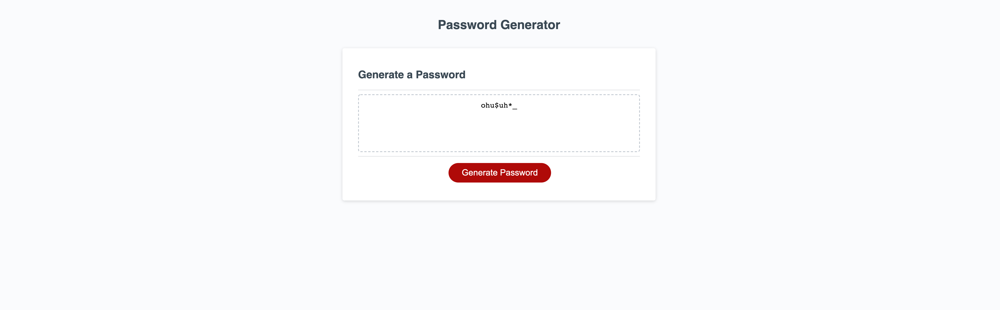

# js-password-gen

## Table of Contents

- [Description](#description)
- [Installation](#installation)
- [User Story](#user_story)
- [Screenshot](#screenshot)
- [Languages](#languages)
- [License](#license)
- [Contact](#contact)

## Description

An application that enables user to generate random passwords based on criteria selected in alert window prompts.

## Installation

Runs in browser.

## User Story

AS AN employee with access to sensitive data
I WANT to randomly generate a password that meets certain criteria
SO THAT I can create a strong password that provides greater security

## Screenshot

## Languages

CSS, Javascript, HTML

## License

MIT

## Testing

none

## Contact:

ShawnArgent (https://github.com/ShawnArgent)  
 kshawn001@gmail.com
